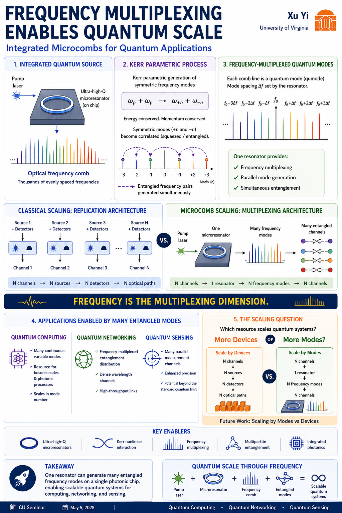

# Integrated Microcombs for Quantum Applications

Constraint-graph explorations inspired by the University of Colorado seminar:

**Xu Yi (University of Virginia)**
*Integrated microcombs for quantum applications*

This repository explores how integrated optical microcombs transform quantum scaling from a device-count problem into a mode-count problem, and how multipartite quantum resources emerge from frequency-multiplexed architectures.

---
<p align="center">
  
</p>

---

## Core Idea

Traditional quantum scaling often requires:

* More sources
* More detectors
* More optical paths
* More hardware

Microcomb architectures introduce a different possibility:

[
1\ \text{pump}
\rightarrow
1\ \text{microresonator}
\rightarrow
N\ \text{frequency modes}
\rightarrow
N\ \text{quantum channels}
]

The scaling resource shifts from **devices** to **frequency modes**.

---

## Repository Structure

```text
notebooks/
├── 00_context.ipynb
├── 07_mode_density.ipynb
├── 13_symmetric_mode_pairs.ipynb
├── 23_multipartite_entanglement_networks.ipynb
└── 29_integration_constraints.ipynb

figures/
results/
src/
```

---

## Notebook Roadmap

| Notebook | Topic                   | Question                                                            |
| -------- | ----------------------- | ------------------------------------------------------------------- |
| 00       | Context                 | Why are microcombs interesting for scalable quantum systems?        |
| 07       | Mode Density            | How does frequency multiplexing increase channel density?           |
| 13       | Symmetric Mode Pairs    | How are entangled frequency pairs organized around a pump mode?     |
| 23       | Multipartite Networks   | How do isolated frequency pairs become connected quantum resources? |
| 29       | Integration Constraints | What limits scaling after multiplexing succeeds?                    |

| Notebook | Focus                                   | Colab                                                                                                                                                                   |
| -------- | --------------------------------------- | ----------------------------------------------------------------------------------------------------------------------------------------------------------------------- |
| 00       | Context and scaling by modes            | [📓](https://colab.research.google.com/github/thinkthoughts/frequency-multiplexed-entanglement/blob/main/notebooks/00_context.ipynb)                            |
| 07       | Frequency-mode density and multiplexing | [📓](https://colab.research.google.com/github/thinkthoughts/frequency-multiplexed-entanglement/blob/main/notebooks/07_frequency_comb.ipynb)                       |
| 13       | Symmetric frequency-mode pairs          | [📓](https://colab.research.google.com/github/thinkthoughts/frequency-multiplexed-entanglement/blob/main/notebooks/13_symmetric_mode_pairs.ipynb)               |
| 23       | Multipartite entanglement networks      | [📓](https://colab.research.google.com/github/thinkthoughts/frequency-multiplexed-entanglement/blob/main/notebooks/23_multipartite_entanglement_networks.ipynb) |
| 29       | Integration constraints                 | [📓](https://colab.research.google.com/github/thinkthoughts/frequency-multiplexed-entanglement/blob/main/notebooks/29_integration_constraints.ipynb)            |
| 31       | Measurement constraints *(planned)*     | 🚧                                                                                                                                                                      |
| }        |                                         |                                                               
---

## Notebook 00 — Context

**Scaling by modes rather than devices**

Key figures:

* Resource stack
* Multiplexing ladder
* Channel density comparison

Main result:

Frequency multiplexing changes the scaling resource from physical hardware to frequency modes.

---

## Notebook 07 — Mode Density

**Addressable quantum channels**

Key figures:

* Frequency comb across fixed bandwidth
* Mode-spacing tradeoffs
* Addressable channel diagrams

Main result:

Available quantum channels depend on the tradeoff between spectral bandwidth and mode spacing.

---

## Notebook 13 — Symmetric Mode Pairs

**Pair generation around the pump**

Key figures:

* Symmetric frequency-mode pair structure
* Pair graph
* Pair adjacency matrix

Main result:

Kerr-based frequency conversion naturally organizes modes into symmetric pairs:

[
(f_0-\Delta f,\ f_0+\Delta f)
]

which serve as the elementary building blocks for larger quantum resources.

---

## Notebook 23 — Multipartite Entanglement Networks

**From pairs to networks**

Key figures:

* Independent pair components
* Coupled pair ladder
* Hub-connected frequency modes
* Multipartite candidate graph
* Connectivity transition

Main result:

Pair generation does not automatically create a quantum network.

Additional connectivity is required before many independent frequency-pair resources behave as a single multipartite structure.

This notebook asks:

> How do isolated mode pairs become connected quantum resources?

---

## Notebook 29 — Integration Constraints

**Scaling after multiplexing**

Key figures:

* Resource stack
* Constraint graph
* Detector scaling burden
* Routing burden proxy
* Constraint cascade

Main result:

Multiplexing creates abundance.

Integration creates constraints.

Increasing mode count can shift bottlenecks toward:

* Routing
* Detection
* Graph management
* Integrated photonic complexity

This notebook asks:

> What becomes limiting after multiplexing succeeds?

---

## Emerging Narrative

```text
Multiplexing
        ↓
Mode abundance
        ↓
Pair generation
        ↓
Multipartite connectivity
        ↓
Integration constraints
```

The central question is no longer:

> Can we generate more modes?

but increasingly:

> Can we route, measure, and manage the resulting quantum network?

---

## Future Directions

### 31 — Measurement Constraints

Can multiplexed generation outpace characterization?

Topics:

* Detector scaling
* State verification
* Tomography burden
* Readout architectures

### 37 — Integrated Detection

How do multiplexed sources and multiplexed detectors co-scale?

### 43 — Quantum Networking Architectures

How do frequency-comb resources map onto future quantum network topologies?

---

## Seminar Inspiration

This repository was inspired by the CU Boulder seminar:

**Xu Yi**
University of Virginia

*Integrated microcombs for quantum applications*

and explores several architectural questions raised by scalable frequency-multiplexed quantum systems.
